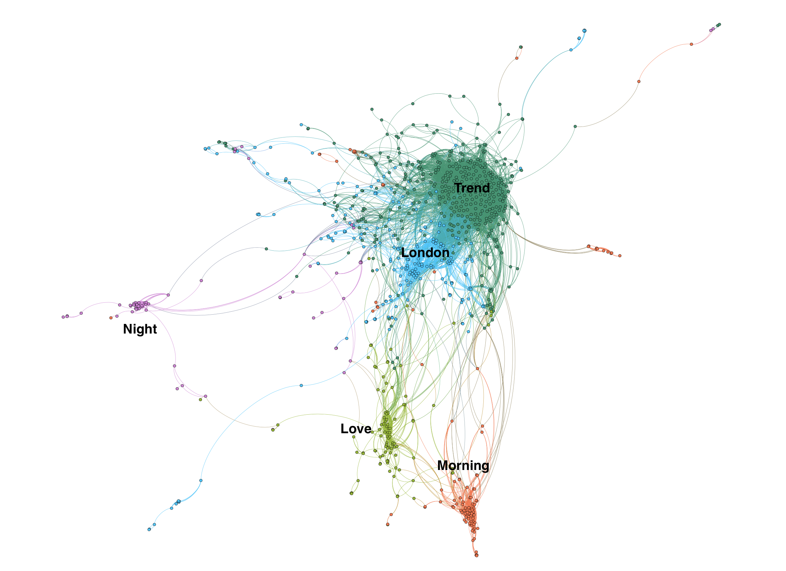

# Tweets-analysis
Clean, cluster tweets from London (around 2k tweets in total) using dbscan and k-means, visualize all tweets and the most popular topics in Gephi.

Here is one example of the results.

